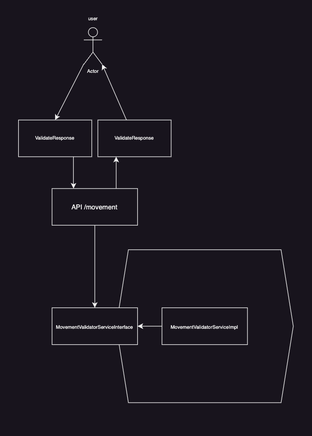
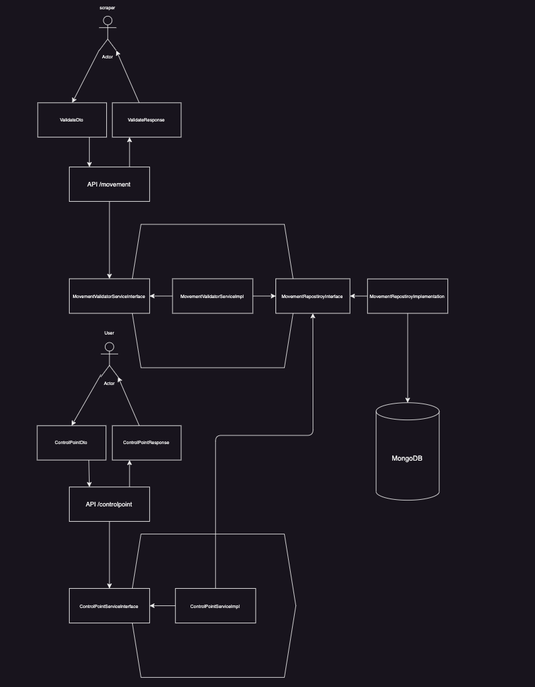

# Technical test ADR

## Probleme
En tant que cabinet d’expertise-comptable, on a besoin de récupérer les opérations
bancaires de ses clients.\
Cette synchronisation bancaire est gérée par des prestataires
externes.\
Ces prestataires font du scrapping pour récupérer les transactions depuis le site des
banques.\
Cette technique n’est pas infaillible, et il arrive parfois que certaines opérations
soient remontées en double ou qu’il en manque quelques-unes.\
Il est primordial de nous assurer de l’intégrité de cette synchronisation, sans quoi la
comptabilité de nos clients pourrait être faussée.

Problème :\
Comment s’assurer que les opérations remontées par la synchronisation bancaire soient
correctes ?\
Nous demandons au client de nous fournir les relevés bancaires de sa banque
pour chaque mois.\
Nous pouvons ainsi avoir des points de contrôle tout au long de l’année
grâce au solde indiqué en fin de période de chaque relevé.\
Le solde indiqué sur un relevé
bancaire est juste.\
En cas d’anomalie, un comptable effectue un contrôle afin de supprimer les doublons ou de
créer manuellement les opérations manquantes.\
Étant donné une liste d’opérations bancaires, ainsi que des points de contrôle, il faut définir
un algorithme et son interface qui permette de valider ou non l’intégrité de la
synchronisation, et le cas échéant, de simplifier au maximum le contrôle manuel du
comptable.

Opération bancaire : { id: number, date: Date, wording: string, amount: number }\
Point de contrôle : { date: Date, balance: number

## Proposals

Two solutions:
 - An algorithm who make the sum of bank operation and check the sum with the Control point.
 - Seetting up a database to handle that for me.

## Proposals architecture

Algorithm side

This solution only provide an api to the user.\
The user send all the data to /movement/validation end point and the application call a service who check all value.

benefits:

 - simple and quickly.
 - more time for quality of code.

disadvantage:

 - can be optimized

Database side

This solution provide to api, /movement and /controlpoint.\
The Scrapper use the /movement end point to post all movement.

- /movement controller record movements in a database.\
the database will delete double and sort movements.
- /controlpoint controller receive all control point to check.\
It get the sum of all movements between two control point date directly form the database and only compare with  control balance.

Benefits:
- Optimized (the parsing and sum are making by the Database)

disadvantage:
- less time for quality of code.
- too big for a first iteration.

## Choosen solution

The solution 1.\
It 's a technical test and i want to demonstrate my capabilities in developement and i think the solution 1 is most adapt to demonstrate it.\
I have scare to spend too much time to implement the solution 2 because it's the one i'm least comfortable with.\
However, I am developing solution 1 while keeping in mind any potential evolution.

## Implementation

I implement the solution 1 with the hexagonal architectur.

The language is typescript with nestjs.\
I will use class-validator and class-transformer to parse user'inputs.

The solution 1 contain only one service: MovementValidator.\
It archived with adapter, application and controller directory.

Adapter is the user'inputs interfaces.\
Domain is all interfaces and model of the service.\
Application is the implementation of interfaces.

I need to define and parse user'inputs.\
I use class-validator decorator to check all sended field and class-transformer to convert date.

Once inputs are valid, i will parse movements consitencies.
I will not return errors with movements consistencies because we know the scrapper will give us degrade data and we havent any impact withe this data at this moment.\
So i only remove duplicate data and sort by date.

Now, imputs are valid and movement are consitencies, i need to check blances.\
I consider balances like the truth so any problemes will be return to the user.
I check if have minum two balances and if balances are sorted.

At this point of the developpement we know all data are valid and consistencies.

Now we need to check if we have all movements.\
So i iterate in balances and isolate movements between two balances.
I considere the movements if later or equal to the first balance and earlier or earlier to the second.

I make the sum of all movement'amount and add the balance of the first and compare to the balance of the second.

If the sum of all movement'amount and the balance of the second balancies are not equal, i will considere the movements are not complete.

I havent implement test, i only use test.json at the root dir.
I play with data and send it by bruno to test my application.

# Conclusion

The algorithm works but we can improve this solution with a database.\
At that moment, I'm thinking I should have chosen solution two.
